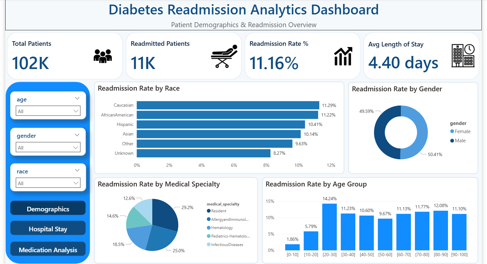
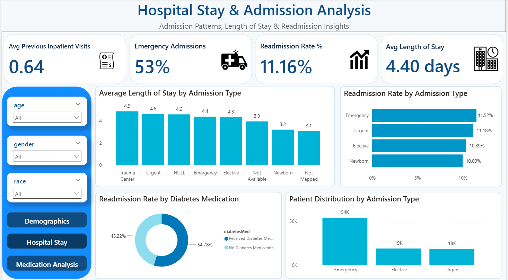
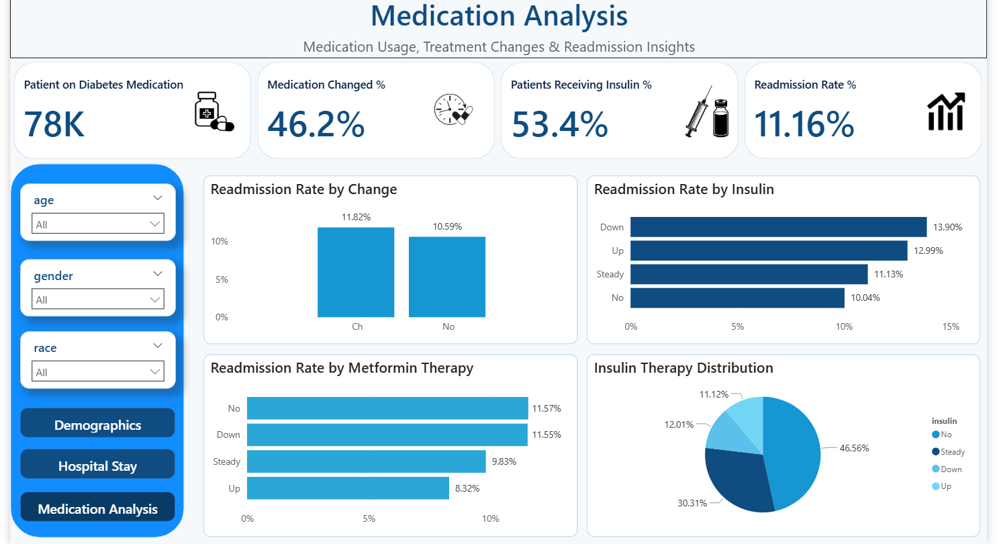
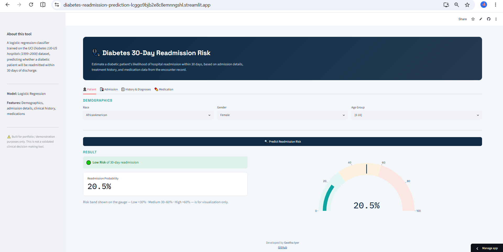

# Diabetes 30-Day Readmission Prediction

An end-to-end healthcare analytics project that predicts whether a diabetic patient will be readmitted to the hospital within 30 days. The project covers data cleaning, exploratory data analysis (EDA), SQL analysis, Power BI dashboard development, machine learning model comparison and deployment using Streamlit.

🔗 **Streamlit App:** <https://diabetes-readmission-prediction-lcggo9bjb2e8c8emnngshl.streamlit.app/>

---

## Project Overview

Hospital readmissions are a major challenge in healthcare, leading to increased costs and affecting patient outcomes. This project analyzes diabetic patient records to identify factors associated with 30-day hospital readmission and builds a predictive machine learning model to estimate readmission risk.

---

## Project Workflow

- Data Cleaning & Preprocessing
- Exploratory Data Analysis (EDA)
- SQL Data Analysis
- Power BI Dashboard Development
- Feature Engineering
- Machine Learning Model Building
- Model Evaluation & Comparison
- Streamlit App Deployment

---

## Tools & Technologies

- Python
- Pandas
- NumPy
- Matplotlib
- Seaborn
- Scikit-learn
- SQL
- Power BI
- Streamlit
- Plotly
- Joblib

---

## Machine Learning Models

The following classification models were trained and evaluated:
- Logistic Regression
- Decision Tree
- Random Forest

### Final Model Selected

**Logistic Regression**

The final model was selected because it achieved the best balance between identifying patients at risk of readmission (Recall) and overall model performance (ROC-AUC).

| Metric | Score |
|---------|------:|
| Accuracy | 66.63% |
| Precision | 17.21% |
| Recall | 52.27% |
| F1-Score | 25.90% |
| ROC-AUC | 0.6472 |

---

## Exploratory Data Analysis

Key insights from EDA:

- Patients with longer hospital stays showed a higher likelihood of readmission.
- A greater number of previous inpatient visits was associated with increased readmission risk.
- Patients prescribed more medications tended to have higher readmission rates.
- The dataset is imbalanced, making Recall an important evaluation metric.

---

## SQL Analysis

SQL was used to perform exploratory analysis on the cleaned dataset, including:

- Readmission trends
- Patient demographics
- Hospital utilization
- Medication-related insights
- Admission and discharge analysis

---

## Power BI Dashboard

An interactive dashboard was created to visualize:

- Readmission trends
- Patient demographics
- Age distribution
- Hospital stay analysis
- Medication analysis

### Dashboard Page- 1 Preview

### Dashboard Page-2 Preview 

### Dashboard Page-3 Preview 

---

## 💻 Streamlit Application

The deployed Streamlit application enables users to enter patient information and predict the probability of 30-day hospital readmission using the trained Logistic Regression model.

### Application Preview

---

## 👩‍💻 Author

**Geetha R. Iyer**
